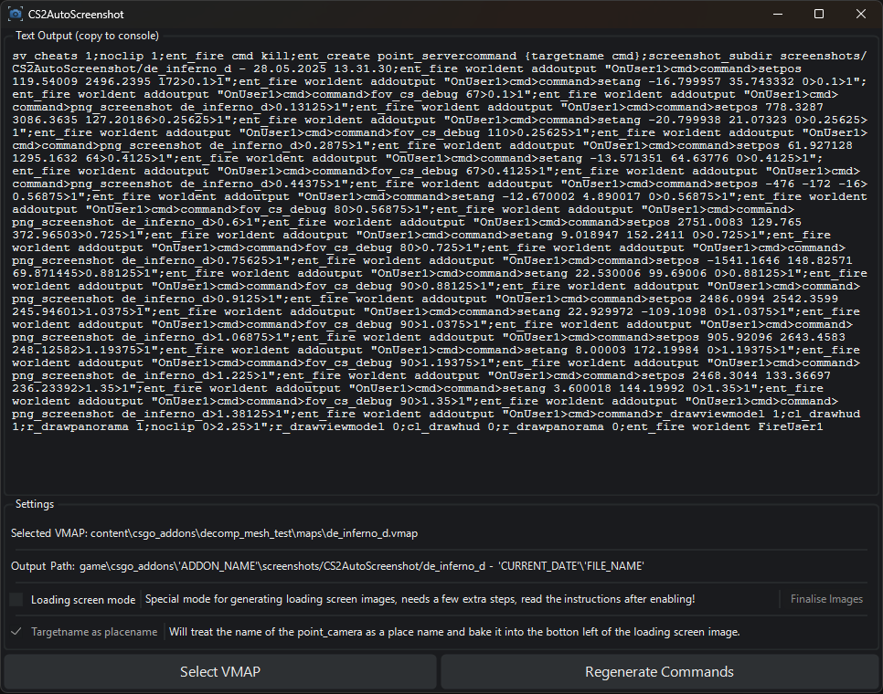

# CS2AutoScreenshot

This app will load a VMAP and read all of the `point_camera` entities from it, then create a list of console commands which when pasted into the console, will take screenshots of the map from the perspective of every `point_camera` it found.

- It is recommended that you kick all bots before running the command.
- Changing the FOV of the `point_camera` entity is supported. 

## In normal mode
- Screenshots will be saved in:
`game\csgo_addons\ADDON_NAME\screenshots\CS2AutoScreenshot\MAP_NAME - DATE`
notice it is saved in the GAME folder and not CONTENT!

## In loading screen image mode
- Screenshots will be saved in:
`content\csgo_addons\ADDON_NAME\panorama\images\map_icons\1080p\FILE_NAME`
- You can enable an option which will treat the targetname of the `point_camera` in the VMAP as a place name, and print it at the bottom left cornet of the screenshot.